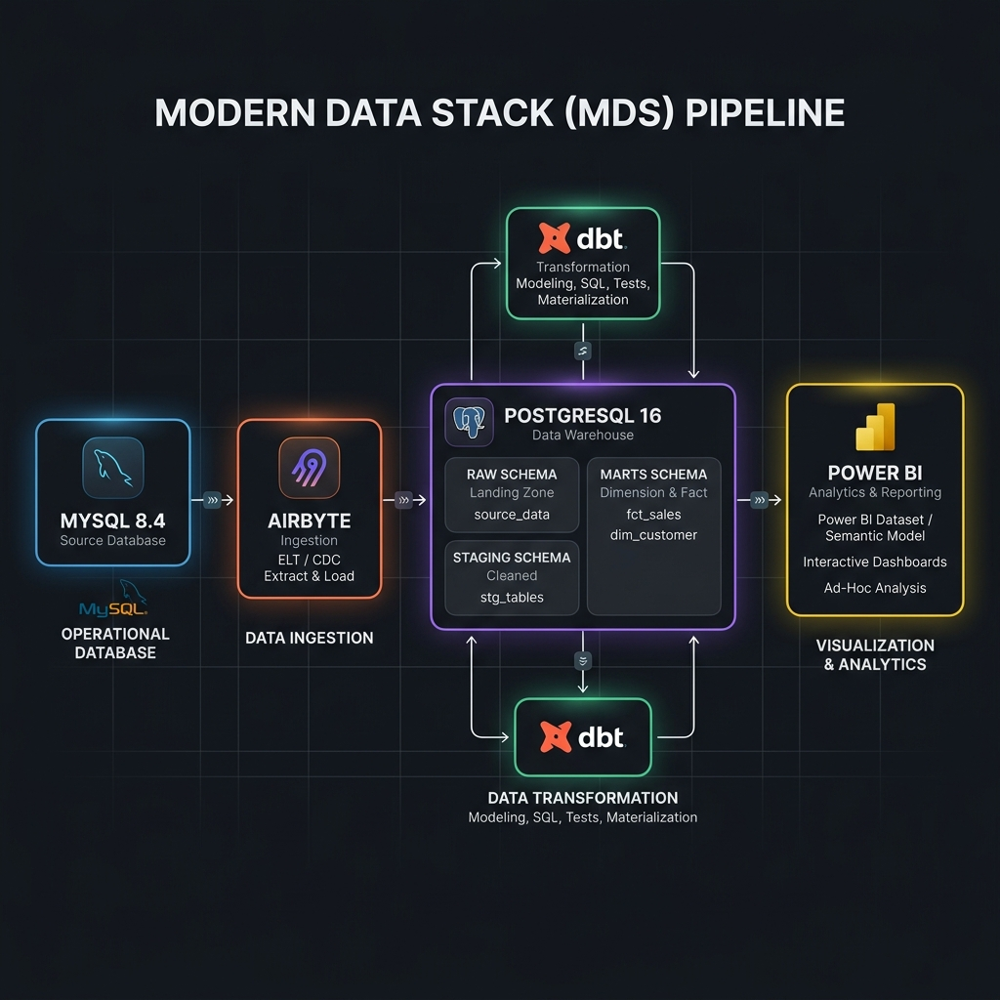
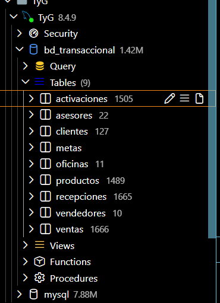
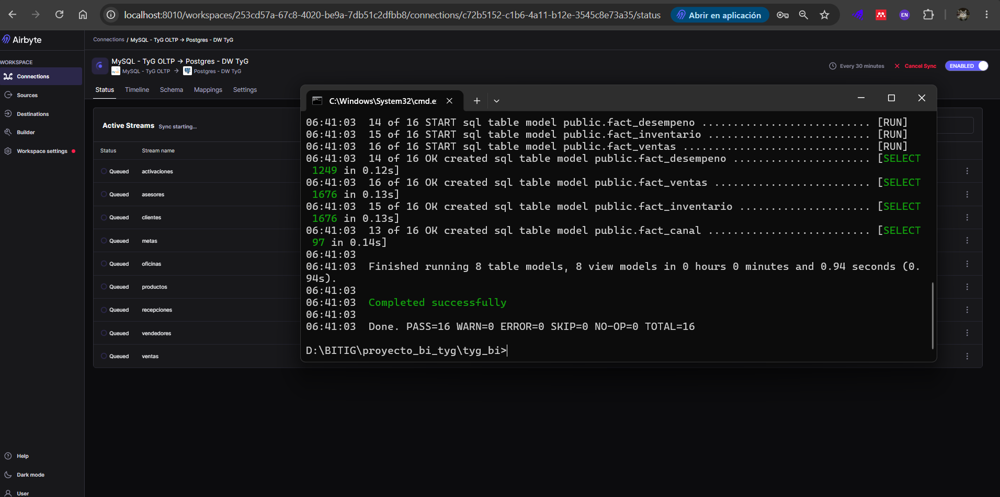
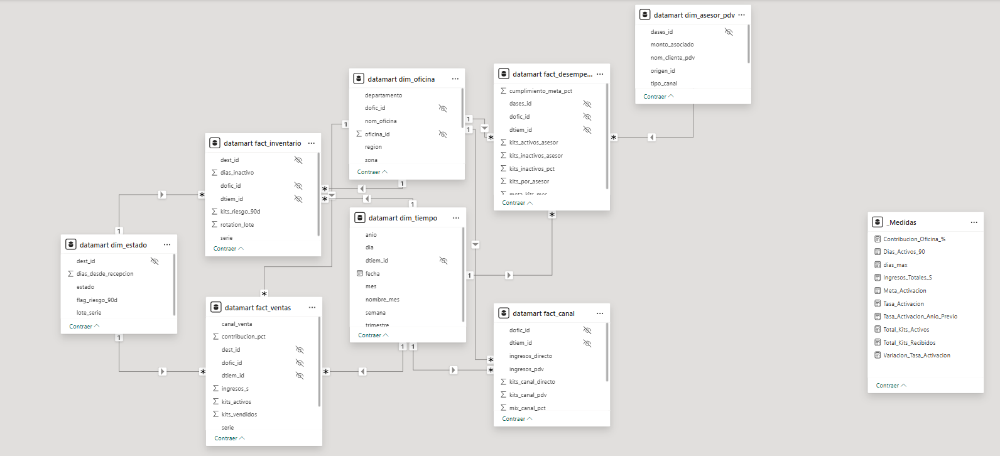

# Documentación Oficial del Proyecto BI

Este documento detalla técnicamente el proceso completo de Inteligencia de Negocios para **T&D Angeles E.I.R.L.**, desde el origen de los datos hasta la toma de decisiones.

---

## 1. Datos generales del proyecto

* **Nombre del proyecto:** Análisis integral de Ventas y Activaciones de Kits DIRECTV
* **Empresa analizada:** T&D Angeles E.I.R.L.
* **Proceso de negocio analizado:** Ciclo de distribución, venta y activación de kits prepago.
* **Herramientas utilizadas:**
    * **OLTP:** MySQL
    * **Ingesta:** Airbyte
    * **Data Warehouse:** PostgreSQL
    * **Transformación:** dbt (Data Build Tool)
    * **Visualización:** Power BI
* **Equipo de Desarrollo:**
    * Henyelrey Lucio Garcia Chura
    * Nick Saim Mayta Jara
    * Jhan Logan Ramos Quispe
    * Brayan Raul Condori Quispe

---

## 2. Resumen ejecutivo

El proyecto implementa un Modern Data Stack para modernizar la gestión de datos de T&D Angeles E.I.R.L[cite: 6]. Se migró de un modelo de reportes manuales basados en consultas sobre bases de datos transaccionales (MySQL), hacia una arquitectura analítica robusta[cite: 6]. Mediante **Airbyte**, los datos se extraen hacia un DataMart en **PostgreSQL**, donde **dbt** modela y aplica reglas de negocio (división de canales Asesor/PDV, estado de kits, etc.)[cite: 6]. Finalmente, **Power BI** consume este modelo semántico brindando a los gerentes visibilidad en tiempo real sobre el stock, activaciones e ingresos, garantizando el control sobre el cumplimiento de metas ante DIRECTV[cite: 6].

---

## 3. Problema de negocio y objetivo analítico

### 3.1 Problema de negocio heredado de U1

| Elemento | Descripción |
| :--- | :--- |
| **Área o proceso involucrado** | Gestión Comercial y Logística de Kits Prepago. <!--[cite: 6] --> |
| **Problema identificado** | La empresa carece de visibilidad centralizada sobre el rendimiento de ventas por oficina, canal y asesor. <!--[cite: 6] --> De 1503 kits registrados, el 21.1% (318 kits) permanecen inactivos sin seguimiento sistemático, no existe un indicador consolidado de riesgo (>90 días desde la recepción), el control de cumplimiento de metas es manual y la gerencia no dispone de información consolidada por canal (Directo vs. PDV) para la toma de decisiones comerciales. <!--[cite: 6] --> |
| **Usuarios principales** | Gerente Comercial, Jefe de Oficina, Jefe de Logística, Analista de Calidad, Jefe de Canal y Supervisor de Asesores. <!--[cite: 6] --> |
| **Decisiones que se buscan mejorar** | <ul><li>¿Qué oficinas presentan mayor cantidad de kits inactivos y cuál es el riesgo financiero asociado? <!--[cite: 6] --></li><li>¿Qué canal de venta (Directo o PDV) genera mayor contribución al ingreso total? <!--[cite: 6] --></li><li>¿Qué asesores o PDV tienen el mejor cumplimiento de meta de activación? <!--[cite: 6] --></li><li>¿Cuántos kits superan los 90 días sin activarse y en qué oficinas están concentrados? <!--[cite: 6] --></li><li>¿Cuál es la tasa de activación mensual por oficina y región? <!--[cite: 6] --></li></ul> |
| **Impacto esperado** | Evitar penalizaciones contractuales ante DIRECTV, anticipar pérdidas por kits expirados, priorizar esfuerzos comerciales en las oficinas de menor rotación, optimizar la estrategia de distribución y ajustar eficientemente las comisiones e incentivos de los canales de venta. <!--[cite: 6] --> |

### 3.2 Objetivo analítico

El objetivo analítico del proyecto es consolidar el ecosistema de datos en un DataMart analítico automatizado que permita medir la rentabilidad por canal de venta, supervisar la tasa de activación de kits y auditar el rendimiento geográfico de las oficinas a través de un dashboard dinámico. <!--[cite: 6] -->

### 3.3 Preguntas de negocio

| Pregunta de negocio | KPI relacionado | Usuario | Visual del dashboard |
| :--- | :--- | :--- | :--- |
| ¿Cuál es el canal de ventas (Asesores vs PDV) que genera mayor volumen de ingresos y activaciones? | Ingresos Totales por Oficina (S/.) <!--[cite: 6] --> / Mix de Canal % <!--[cite: 6] --> | Gerente Comercial / Jefe de Canal <!--[cite: 6] --> | Gráfico de rectángulos (Treemap) de ingresos por oficina y Gráfico de barras de Suma de Monto de venta por Canal. |
| ¿Cuál es la tasa de conversión de kits "Inactivos" a "Activos" (tasa de activación por oficina y mes)? | Tasa de Activación de Kits (%) <!--[cite: 6] --> | Gerente Comercial / Jefe de Oficina <!--[cite: 6] --> | Gráfico de medidor (Gauge) de Tasa de Activación y Medida Destino, y Gráfico de líneas temporal por Año, Trimestre, Mes y Día. |
| ¿Qué oficinas/asesores lideran el cumplimiento de metas impuestas por DIRECTV? | Cumplimiento de Meta de Activaciones (%) <!--[cite: 6] --> | Supervisor de Asesores / Gerente Comercial <!--[cite: 6] --> | Gráfico de columnas de Suma de Meta_Kits por Oficina y Tarjeta de Tasa de Activación contra Meta. |
| ¿Cuántos kits llevan más de 90 días sin activarse (kits en riesgo) y cómo se distribuyen geográficamente? | Kits en Riesgo - Inactivos > 90 días <!--[cite: 6] --> | Jefe de Logística / Analista de Calidad <!--[cite: 6] --> | Gráfico de barras horizontales de Kits en Riesgo por Oficina y Tabla detallada con número de serie, lote, año, mes y días en stock. |

---

### 4. KPIs

#### KPIs principales

##### KPI P1-1: Tasa de Activación de Kits (%)
| Campo | Detalle |
| :--- | :--- |
| **KPI** | Tasa de Activación de Kits (%) |
| **Proceso de Negocio** | P1 — Ventas y Activación |
| **Definición** | Porcentaje de kits vendidos (activados) sobre el total de kits recibidos en un período, por oficina o región. <!--[cite: 6] --> |
| **Fórmula** | `Tasa_Activacion = (Kits_Activos / Kits_Recibidos) × 100` <!--[cite: 6] --> |
| **Frecuencia** | Mensual <!--[cite: 6] --> |
| **Usuarios** | Gerente Comercial, Jefe de Oficina, DIRECTV <!--[cite: 6] --> |
| **Fuente de Datos** | BD transaccional: tablas VENTAS y KITS (campos: estado, fecha_venta, id_oficina) <!--[cite: 6] --> |
| **Impacto** | Permite identificar qué oficinas tienen baja rotación de inventario y tomar acciones preventivas antes de que kits entren en riesgo de penalización ante DIRECTV. <!--[cite: 6] --> |

##### KPI P1-2: Ingresos Totales por Oficina (S/.)
| Campo | Detalle |
| :--- | :--- |
| **KPI** | Ingresos Totales por Oficina (S/.) |
| **Proceso de Negocio** | P1 — Ventas y Activación |
| **Definición** | Suma de los montos de venta generados por cada oficina en un período. El canal directo genera S/. 220 por kit y el canal PDV genera S/. 160 por kit. <!--[cite: 6] --> |
| **Fórmula** | `Ingresos_S = SUM(monto_venta) GROUP BY id_oficina, mes` <!--[cite: 6] --> |
| **Frecuencia** | Mensual <!--[cite: 6] --> |
| **Usuarios** | Gerente Comercial, Jefe de Oficina, Área de Contabilidad <!--[cite: 6] --> |
| **Fuente de Datos** | BD transaccional: tabla VENTAS (campo: monto, id_oficina, fecha_venta) <!--[cite: 6] --> |
| **Impacto** | Facilita el control financiero y permite identificar qué oficinas generan mayor aporte al presupuesto mensual de la empresa. <!--[cite: 6] --> |

##### KPI P1-3: Contribución Porcentual de Oficina (%)
| Campo | Detalle |
| :--- | :--- |
| **KPI** | Contribución Porcentual de Oficina (%) |
| **Proceso de Negocio** | P1 — Ventas y Activación |
| **Definición** | Porcentaje del ingreso total que aporta cada oficina regional, permitiendo identificar cuáles tienen mayor peso comercial. <!--[cite: 6] --> |
| **Fórmula** | `Contribucion_pct = (Ingresos_Oficina / Ingresos_Total) × 100` <!--[cite: 6] --> |
| **Frecuencia** | Mensual <!--[cite: 6] --> |
| **Usuarios** | Gerente Comercial, Gerente General <!--[cite: 6] --> |
| **Fuente de Datos** | BD transaccional: tabla VENTAS (campo: monto, id_oficina) <!--[cite: 6] --> |
| **Impacto** | Permite priorizar esfuerzos comerciales en las oficinas de mayor impacto y redistribuir recursos en las de menor contribución. <!--[cite: 6] --> |

---

#### KPIs secundarios

##### KPI P2-1: Kits en Riesgo — Inactivos > 90 días
| Campo | Detalle |
| :--- | :--- |
| **KPI** | Kits en Riesgo — Inactivos > 90 días |
| **Proceso de Negocio** | P2 — Inventario y Riesgo |
| **Definición** | Cantidad de kits que llevan más de 90 días desde su fecha de recepción sin ser activados, clasificados por oficina y región. Un kit en riesgo puede implicar penalización contractual con DIRECTV. <!--[cite: 6] --> |
| **Fórmula** | `Kits_Riesgo_90d = COUNT(serie) WHERE (FECHA_ACTUAL - fecha_recepcion) > 90 AND estado = 'Inactivo'` <!--[cite: 6] --> |
| **Frecuencia** | Semanal / Mensual <!--[cite: 6] --> |
| **Usuarios** | Gerente Comercial, Jefe de Logística, Jefe de Oficina, Analista de Calidad <!--[cite: 6] --> |
| **Fuente de Datos** | BD transaccional: tabla KITS (campos: fecha_recepcion, id_estado) + tabla ESTADOS <!--[cite: 6] --> |
| **Impacto** | Permite anticipar pérdidas por kits expirados o penalizaciones contractuales por baja activación, facilitando acciones correctivas de redistribución o campañas de activación urgente. <!--[cite: 6] --> |

##### KPI P2-2: Días Promedio de Inactividad
| Campo | Detalle |
| :--- | :--- |
| **KPI** | Días Promedio de Inactividad |
| **Proceso de Negocio** | P2 — Inventario y Riesgo |
| **Definición** | Promedio de días transcurridos entre la fecha de recepción del kit y la fecha actual (o de venta), calculado para todos los kits con estado Inactivo por oficina. <!--[cite: 6] --> |
| **Fórmula** | `Dias_Inactivo_Prom = AVG(DATEDIFF(CURRENT_DATE, fecha_recepcion)) WHERE estado = 'Inactivo'` <!--[cite: 6] --> |
| **Frecuencia** | Semanal <!--[cite: 6] --> |
| **Usuarios** | Jefe de Logística, Jefe de Oficina <!--[cite: 6] --> |
| **Fuente de Datos** | BD transaccional: tabla KITS (campos: fecha_recepcion, id_estado) <!--[cite: 6] --> |
| **Impacto** | Identifica oficinas con kits envejecidos en almacén. Un promedio elevado indica baja rotación and necesidad de campañas de activación. <!--[cite: 6] --> |

##### KPI P2-3: Rotación de Lote (días promedio desde recepción a venta)
| Campo | Detalle |
| :--- | :--- |
| **KPI** | Rotación de Lote (días promedio desde recepción a venta) |
| **Proceso de Negocio** | P2 — Inventario y Riesgo |
| **Definición** | Tiempo promedio en días que tarda un kit en ser vendido desde que fue recibido en oficina, agrupado por lote o mes de recepción. <!--[cite: 6] --> |
| **Fórmula** | `Rotation_Lote = AVG(DATEDIFF(fecha_venta, fecha_recepcion)) WHERE estado = 'Activo'` <!--[cite: 6] --> |
| **Frecuencia** | Mensual <!--[cite: 6] --> |
| **Usuarios** | Jefe de Logística, Gerente Comercial <!--[cite: 6] --> |
| **Fuente de Datos** | BD transaccional: tabla KITS y VENTAS (campos: fecha_recepcion, fecha_venta, id_serie) <!--[cite: 6] --> |
| **Impacto** | Permite evaluar la velocidad de rotación del inventario por lote y por oficina. Lotes con baja rotación requieren intervención comercial urgente. <!--[cite: 6] --> |

##### KPI P3-1: Mix de Canal — % Ventas Directo vs. PDV
| Campo | Detalle |
| :--- | :--- |
| **KPI** | Mix de Canal — % Ventas Directo vs. PDV |
| **Proceso de Negocio** | P3 — Canal y Desempeño |
| **Definición** | Distribución porcentual de las ventas entre el canal directo (asesores propios, S/. 220) y el canal PDV (puntos de venta externos, S/. 160), por región y mes. <!--[cite: 6] --> |
| **Fórmula** | `Mix_Canal_PDV = (Kits_PDV / Total_Kits_Vendidos) × 100` <br> `Mix_Canal_Directo = (Kits_Directo / Total_Kits_Vendidos) × 100` <!--[cite: 6] --> |
| **Frecuencia** | Mensual <!--[cite: 6] --> |
| **Usuarios** | Jefe de Canal, Gerente Comercial <!--[cite: 6] --> |
| **Fuente de Datos** | BD transaccional: tabla VENTAS (campo: canal) + tabla CLIENTES_PDV (campo: tipo_canal) <!--[cite: 6] --> |
| **Impacto** | Permite optimizar la estrategia de distribución, identificar dependencia excesiva de un canal y ajustar comisiones o incentivos según el tipo de canal. <!--[cite: 6] --> |

##### KPI P3-2: Cumplimiento de Meta de Activaciones (%)
| Campo | Detalle |
| :--- | :--- |
| **KPI** | Cumplimiento de Meta de Activaciones (%) |
| **Proceso de Negocio** | P3 — Canal y Desempeño |
| **Definición** | Porcentaje de kits activados sobre la meta mensual asignada por DIRECTV a cada oficina o asesor. Requiere la tabla METAS como fuente adicional al OLTP. <!--[cite: 6] --> |
| **Fórmula** | `Cumplimiento_Meta_pct = (Kits_Activos_Mes / Meta_Kits_Mes) × 100` <!--[cite: 6] --> |
| **Frecuencia** | Mensual <!--[cite: 6] --> |
| **Usuarios** | Supervisor de Asesores, Jefe de Oficina, Gerente Comercial, DIRECTV <!--[cite: 6] --> |
| **Fuente de Datos** | BD transaccional (VENTAS, KITS) + Tabla METAS (id_meta, id_oficina, mes, anio, meta_kits) <!--[cite: 6] --> |
| **Impacto** | Facilita la evaluación del rendimiento de cada oficina y asesor frente a la meta oficial de DIRECTV, siendo base para decisiones de incentivos, reasignación o capacitación. <!--[cite: 6] --> |

##### KPI P3-3: Kits Vendidos por Asesor / % Kits Inactivos por Asesor
| Campo | Detalle |
| :--- | :--- |
| **KPI** | Kits Vendidos por Asesor / % Kits Inactivos por Asesor |
| **Proceso de Negocio** | P3 — Canal y Desempeño |
| **Definición** | Cantidad de kits vendidos por cada asesor o PDV en el mes, y el porcentaje de esos kits que permanecen inactivos. Permite identificar asesores con baja tasa de activación. <!--[cite: 6] --> |
| **Fórmula** | `Kits_x_Asesor = COUNT(serie) GROUP BY id_cliente_pdv` <br> `Pct_Inactivos = (Kits_Inactivos_Asesor / Kits_Vendidos_Asesor) × 100` <!--[cite: 6] --> |
| **Frecuencia** | Mensual <!--[cite: 6] --> |
| **Usuarios** | Supervisor de Asesores, Jefe de Oficina <!--[cite: 6] --> |
| **Fuente de Datos** | BD transaccional: tabla VENTAS + KITS + CLIENTES_PDV (campos: id_cliente_pdv, tipo_canal, estado) <!--[cite: 6] --> |
| **Impacto** | Identifica asesores o PDV con alto volumen de kits inactivos, permitiendo intervenciones de capacitación o restricción de stock para mejorar la tasa de activación. <!--[cite: 6] --> |


### 4.1 Criterios de interpretación

#### Fichas de Interpretación - Proceso 1: Ventas y Activación

##### KPI P1-1: Tasa de Activación de Kits (%)
| KPI | Bajo | Esperado | Alto / cumplido | Accion sugerida |
| :--- | :--- | :--- | :--- | :--- |
| **Tasa de Activación de Kits (%)** | < 80% de activación (Actualmente la empresa se sitúa en 78.9%[cite: 6]). | Entre 80% y 89% de activación de kits recibidos[cite: 6]. | ≥ 90% de activación (Meta óptima según Directv[cite: 6]). | Lanzar campañas de activación urgente y redistribuir stock de oficinas estancadas hacia las de mejor rotación[cite: 6]. |

##### KPI P1-2: Ingresos Totales por Oficina (S/.)
| KPI | Bajo | Esperado | Alto / cumplido | Accion sugerida |
| :--- | :--- | :--- | :--- | :--- |
| **Ingresos Totales por Oficina (S/.)** | < 80% del presupuesto de recaudación estimado para la oficina[cite: 6]. | Entre 80% y 99% de la cuota de ingresos asignada[cite: 6]. | ≥ 100% de la meta de ingresos alcanzada (S/. 220 directo / S/. 160 PDV[cite: 6]). | Identificar las oficinas que generan menor aporte al presupuesto mensual para aplicar estrategias de impulso comercial[cite: 6]. |

##### KPI P1-3: Contribución Porcentual de Oficina (%)
| KPI | Bajo | Esperado | Alto / cumplido | Accion sugerida |
| :--- | :--- | :--- | :--- | :--- |
| **Contribución Porcentual de Oficina (%)** | < 5% del aporte total global de ingresos (peso comercial deficiente[cite: 6]). | Entre 5% y 15% de participación sobre el ingreso total de la empresa[cite: 6]. | > 15% de contribución porcentual (oficinas líderes del peso comercial[cite: 6]). | Priorizar esfuerzos y recursos en las sucursales de mayor impacto económico y reestructurar las de baja participación[cite: 6]. |

---

#### Fichas de Interpretación - Proceso 2: Inventario y Riesgo

##### KPI P2-1: Kits en Riesgo — Inactivos > 90 días
| KPI | Bajo | Esperado | Alto / cumplido | Accion sugerida |
| :--- | :--- | :--- | :--- | :--- |
| **Kits en Riesgo — Inactivos > 90 días** | > 15% de kits estancados sin activar por más de 90 días (Riesgo alto de penalización[cite: 6]). | Entre 5% y 15% de kits en almacén superando el límite de inactividad[cite: 6]. | < 5% de kits en riesgo (Control logístico e inventario saludable[cite: 6]). | Lanzar alertas logísticas inmediatas, priorizar la salida de lotes antiguos y ejecutar activaciones de contingencia[cite: 6]. |

##### KPI P2-2: Días Promedio de Inactividad
| KPI | Bajo | Esperado | Alto / cumplido | Accion sugerida |
| :--- | :--- | :--- | :--- | :--- |
| **Días Promedio de Inactividad** | > 60 días en promedio transcurridos desde la recepción del kit sin registrar venta[cite: 6]. | Entre 30 y 60 días promedio de inactividad en el almacén de la oficina[cite: 6]. | < 30 días promedio transcurridos (Alta rotación física en oficina[cite: 6]). | Identificar las oficinas con kits envejecidos en almacén para acelerar promociones o redistribución de stock[cite: 6]. |

##### KPI P2-3: Rotación de Lote (días promedio desde recepción a venta)
| KPI | Bajo | Esperado | Alto / cumplido | Accion sugerida |
| :--- | :--- | :--- | :--- | :--- |
| **Rotación de Lote** | > 45 días promedio en concretar la venta de un kit desde su fecha de lote de recepción[cite: 6]. | Entre 30 y 45 días promedio en el ciclo recepción-venta de kits activos[cite: 6]. | < 30 días promedio (Velocidad de venta y rotación de lote ideal[cite: 6]). | Realizar una intervención comercial urgente sobre los lotes estancados por fecha de recepción para agilizar su salida[cite: 6]. |

---

#### Fichas de Interpretación - Proceso 3: Canal y Desempeño de Asesores

##### KPI P3-1: Mix de Canal — % Ventas Directo vs. PDV
| KPI | Bajo | Esperado | Alto / cumplido | Accion sugerida |
| :--- | :--- | :--- | :--- | :--- |
| **Mix de Canal** | Dependencia crítica (> 90%) de un solo canal de venta, afectando el margen o volumen[cite: 6]. | Proporción equilibrada alineada a la rentabilidad (ej: 30% Directo / 70% PDV[cite: 6]). | Proporción exacta según la meta estratégica de distribución del período[cite: 6]. | Ajustar las comisiones de los asesores o los incentivos de los puntos PDV para balancear el mix comercial[cite: 6]. |

##### KPI P3-2: Cumplimiento de Meta de Activaciones (%)
| KPI | Bajo | Esperado | Alto / cumplido | Accion sugerida |
| :--- | :--- | :--- | :--- | :--- |
| **Cumplimiento de Meta** | < 80% del cumplimiento de las activaciones frente a la meta exigida por DIRECTV[cite: 6]. | Entre 80% y 99% de alcance de la meta mensual oficial de la sucursal[cite: 6]. | ≥ 100% de la meta de activaciones lograda (Saludable / Sujeto a incentivos[cite: 6]). | Tomar decisiones directas de capacitación a asesores de bajo rendimiento o reasignación de cuotas de stock[cite: 6]. |

##### KPI P3-3: Kits Vendidos por Asesor / % Kits Inactivos por Asesor
| KPI | Bajo | Esperado | Alto / cumplido | Accion

---

## 5. Arquitectura BI implementada

### 5.1 Diagrama de arquitectura
*(Inserta aquí la imagen de tu diagrama de arquitectura)*


### 5.2 Componentes implementados
1. **Fuente de Datos:** Servidor MySQL alojando las tablas del ERP/Sistema de ventas de la empresa.
2. **Motor de Ingesta:** Airbyte (configurado con conectores MySQL -> Postgres).
3. **Almacenamiento (Data Warehouse):** PostgreSQL estructurado por esquemas separados para RAW, STAGING y MARTS.
4. **Transformación:** Proyecto dbt orquestando la limpieza de fechas, estandarización de estados ("Activo", "Inactivo") y consolidación de la fact table.
5. **Capa Semántica y BI:** Power BI Desktop conectado vía DirectQuery/Import Mode a PostgreSQL.

---

## 6. Fuente transaccional OLTP

### 6.1 Tablas utilizadas
* `ventas`: Registra cada transacción, fecha, oficina y estado del kit.
* `vendedores` / `asesores`: Personal propio de T&D Angeles.
* `pdv`: Puntos de venta externos asociados.
* `oficinas`: Sucursales regionales (Juliaca, Cusco, Madre de Dios, etc.).
* `metas`: Tablas de cuotas asignadas por DIRECTV a cada oficina.

### 6.2 Evidencia del origen



---

## 7. Pipeline de ingesta y transformación

### 7.1 Ingesta
Configurada a través de **Airbyte**. Se crearon flujos de replicación para pasar las tablas transaccionales en su forma "cruda" al esquema `airbyte_internal` / `raw` de PostgreSQL. 

### 7.2 Capas de datos
* **Capa Bronze (Raw):** Datos extraídos tal cual desde MySQL.
* **Capa Silver (Staging):** Uso de dbt para crear modelos como `stg_ventas`, limpiando nulos, estandarizando tipos de datos (resolviendo los problemas de sincronización de fechas detectados).
* **Capa Gold (Marts):** Modelos finales, agrupados en dimensiones (`dim_oficina`, `dim_canal`) y tablas de hechos (`fact_ventas`).

### 7.3 Modelos de transformación
Se aplicaron reglas directamente en el código de dbt:
```sql
-- Ejemplo lógico de transformación dbt para cálculo de ingresos
SELECT 
    id_venta,
    fecha_venta,
    id_oficina,
    canal_venta,
    estado_kit,
    CASE 
        WHEN canal_venta = 'Asesor' THEN 220 
        WHEN canal_venta = 'PDV' THEN 160 
        ELSE 0 
    END as monto_ingreso
FROM {{ ref('stg_ventas') }}
```
---

### 7.4 Evidencia de ejecución

*(Inserta capturas de la UI de Airbyte ejecutándose y la terminal con el comando dbt run en verde)*



---

## 8. Data Warehouse / DataMart

### 8.1 Modelo dimensional

Se construyó bajo un esquema en Estrella (Star Schema).

* **Hechos:** `Fact_Ventas` (Granularidad: Venta individual por kit).
* **Dimensiones:** * `Dim_Tiempo` (Calendario)
    * `Dim_Oficina` (Geográfica)
    * `Dim_Canal` (Asesores / PDV)
    * `Dim_Estado` (Activo / Inactivo)

### 8.2 Diagrama del modelo

*(Inserta aquí la captura del modelo entidad-relación del DataMart)*



### 8.3 Reglas de negocio aplicadas

* **Atribución de Canal:** Las tarifas (S/. 220 y S/. 160) se asignan dinámicamente según el tipo de canal de distribución.
* **Temporalidad:** Todas las fechas de MySQL se convirtieron a `TIMESTAMP` estándar en PostgreSQL para asegurar comparabilidad mensual.

---

## 9. Modelo semántico en Power BI

### 9.1 Relaciones

El modelo en Power BI replica el esquema en estrella, estableciendo relaciones de **1 a Muchos (1:*)** con dirección de filtro **Única** desde las Dimensiones hacia la tabla de Hechos.

### 9.2 Medidas DAX

Se implementaron medidas explícitas para evitar dependencias implícitas:

```dax
// Total de ingresos
Total_Ingresos = SUM(Fact_Ventas[monto_ingreso])

// Cantidad total de kits vendidos
Total_Kits = COUNTROWS(Fact_Ventas)

// Tasa de Activación
Tasa_Activacion = 
DIVIDE(
    CALCULATE([Total_Kits], Dim_Estado[Estado] = "Activo"),
    [Total_Kits], 
    0
)

// % Cumplimiento de Meta
Cumplimiento_Meta = DIVIDE([Total_Kits], SUM(Dim_Oficina[Meta_Mensual]), 0)
```

---

### 9.3 Jerarquías y campos de análisis
Jerarquía Geográfica: Región -> Ciudad -> Oficina.

Jerarquía Temporal: Año -> Trimestre -> Mes -> Día.

---

### 10. Dashboard interactivo
El producto final consta de tableros directivos.

---

### 10.1 Páginas del dashboard
(Inserta aquí las capturas de cada página del Dashboard. Ej: Resumen General, Detalle por Oficina)

---

### 10.2 Interactividad implementada
Uso de Bookmarks para cambiar de vista.

Drill-through (Obtención de detalles) desde la gráfica de Región para ver a los vendedores específicos de la zona.

Uso de Tooltips personalizados para ver los detalles de kits activos/inactivos al pasar el mouse por el gráfico de barras.

---

### 10.3 Comparativos y KPIs obligatorios del dashboard
El dashboard incluye: Tarjetas superiores con KPIs principales (Monto Total, Kits Totales, % Activados), Gráficos de barra comparando ventas de Asesores vs PDV, y un gráfico de medidor (Gauge) evaluando el alcance de la meta mensual.

---

### 10.4 Capturas obligatorias
(Inserta aquí acercamientos a los gráficos más importantes)

---

## 11. Validación de KPIs
### 11.1 Conciliación SQL vs Power BI
Para asegurar la fiabilidad, comparamos los datos del DW (PostgreSQL) con los resultados de Power BI.

### 11.2 Consultas de validación

```dax
-- Validando el Ingreso Total de un mes específico para conciliar con Power BI
SELECT 
    EXTRACT(MONTH FROM fecha_venta) as mes,
    SUM(monto_ingreso) as Total_Ingresos
FROM dw_marts.fact_ventas
GROUP BY 1;
```
### 11.3 Hallazgos de validación
Los montos obtenidos mediante las consultas SQL coinciden exactamente a nivel céntimos con las tarjetas mostradas en Power BI, verificando que no hubo pérdida de datos durante la ingesta con Airbyte ni errores lógicos en DAX.

## 12. Trazabilidad fuente-modelo-KPI-dashboard
- Origen: MySQL (tabla: ventas, columna: precio_sugerido)

- Ingesta: Airbyte (stream: ventas_raw)

- Transformación: dbt (modelo: stg_ventas -> fact_ventas, columna: monto_ingreso)

- Modelo BI: Power BI (Medida: Total_Ingresos)

- Dashboard: Tarjeta Superior Izquierda (Ingresos Totales en S/.)

## 13. Calidad de datos y gobierno mínimo
### 13.1 Controles aplicados
Unicidad: Pruebas genéricas en dbt (unique, not_null) en las Primary Keys de los kits (IDs).

Integridad Referencial: Test de relationships en dbt asegurando que todo id_oficina en la tabla de ventas exista en la tabla de sucursales.

### 13.2 Reglas de gobierno documentadas
Si en el futuro la empresa modifica los precios por canal (S/. 220 o S/. 160), la actualización está gobernada para realizarse en la capa de transformación (dbt) y no en la visualización, asegurando una "Única Fuente de Verdad".

## 14. Hallazgos, interpretación y decisión recomendada
Hallazgos principales:

Existe una clara diferencia de volumen entre los PDV y los Asesores Directos.

Algunas oficinas como Juliaca cumplen rápidamente sus metas, pero oficinas en otras regiones tienen una alta tasa de kits en estado "Inactivo".

### 14.1 Decisión final propuesta
Recomendación Gerencial: Se sugiere reestructurar la asignación de metas por parte de DIRECTV, enfocando campañas de activación (no solo venta) en las regiones con menor porcentaje de conversión, y potenciar con bonos a los Asesores del canal propio para incrementar la rentabilidad directa de la empresa.

## 15. Sustentación técnica
### 15.1 Presentación PPT de sustentación
(Enlace a la presentación de Canva, Google Slides o archivo subido)

## 16. Evidencias obligatorias
(Espacio designado para colocar pantallazos de: el modelo físico, ejecuciones y repositorios)

## 17. Aporte individual del equipo
IntegranteComponente / Actividad RealizadaEvidencia / AutoevaluaciónNick Saim Mayta JaraSesión 1/2: Creación del proceso y sincronización de fechas.Resolución de complejidad en fechas MySQL-PostgreSQL.Henyelrey Lucio Garcia ChuraSesión 5/6: Implementación del flujo de Airbyte e ingesta.Operación y validación de conectores; pendiente optimizar test automáticos.Jhan Logan Ramos QuispeModelos Marts (dbt): Armado de tablas de hechos.Resolución de relaciones de fact tables para la estructura en estrella.Brayan Raul Condori QuispePower BI y DAX: Modelo semántico y dashboards.Diseño visual y aplicación de las medidas en tarjetas y gráficos.

## 18. Conclusiones
La integración de Airbyte, dbt y Power BI sobre un DataMart en PostgreSQL ha logrado superar con éxito las limitaciones del sistema transaccional de T&D Angeles E.I.R.L. El equipo logró desacoplar el origen de datos de la capa analítica, logrando automatización, estandarización de indicadores (precios y activaciones) y una escalabilidad sólida para el futuro. Este proyecto evidencia la superioridad de un pipeline de datos moderno sobre las tradicionales extracciones manuales.

## Documentacion Completa

Link del documento: [Ver Documentación Completa en SharePoint](https://upeuedupe-my.sharepoint.com/:w:/g/personal/henyelrey_garcia_upeu_edu_pe/IQD3mQHHgqjTTY9GxZzlW86yAVUNNByAL9nSXUt_cl2xZvs?e=8hwzzh)