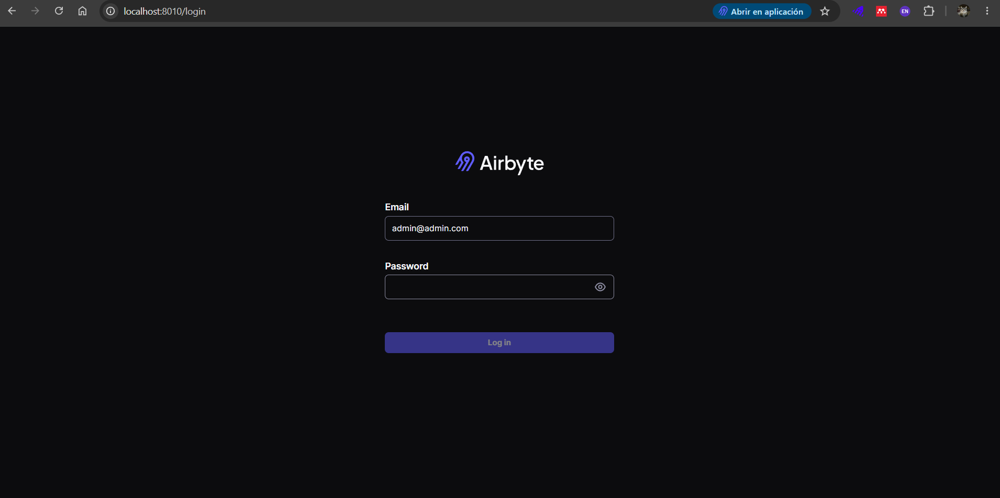
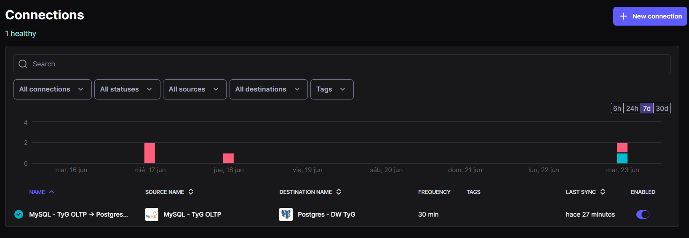
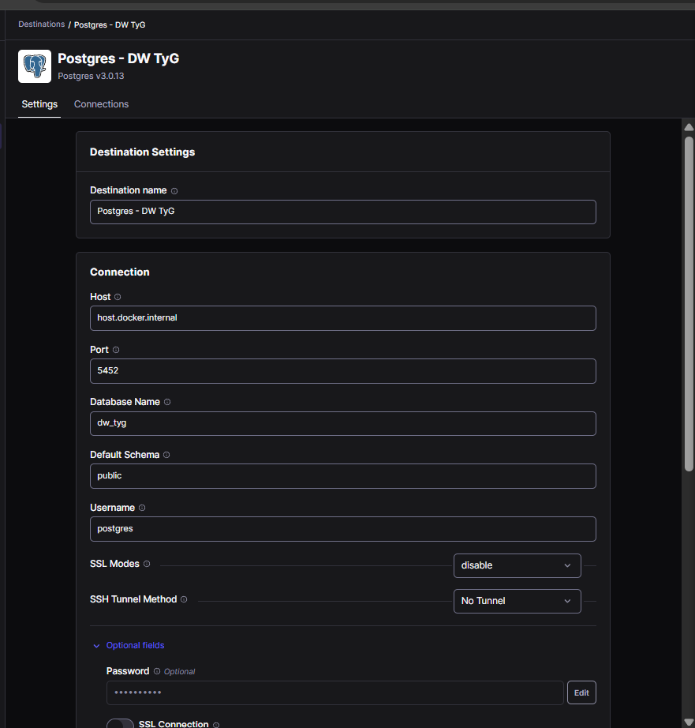
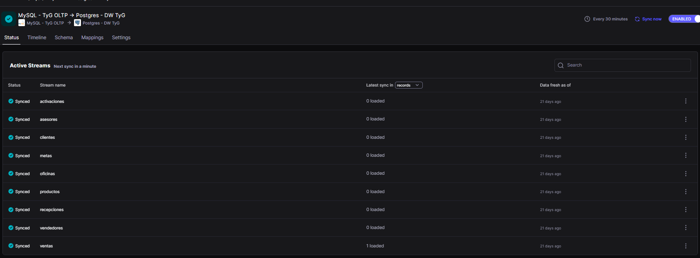

# Guía de Ingesta y Replicación de Datos con Airbyte

Esta guía técnica describe el proceso detallado para implementar, configurar y ejecutar el pipeline de Extracción y Carga (EL) en el proyecto de Business Intelligence de **T&D Angeles E.I.R.L.** El flujo de datos consiste en replicar los datos transaccionales desde el sistema origen (MySQL) hacia el Data Warehouse analítico (PostgreSQL) utilizando **Airbyte** como motor de ingesta de datos.

---

## 1. Introducción y Objetivo

El pipeline de Extracción y Carga (EL) está diseñado para mover los datos operativos de la empresa sin impactar el rendimiento del entorno transaccional. La arquitectura técnica establece un flujo directo desde el motor de base de datos OLTP **MySQL 8.4** (expuesto en el puerto `23306`) hacia el Data Warehouse analítico en **PostgreSQL 16** (expuesto en el puerto `5452`, base de datos centralizada `dw_tyg`). 

El objetivo principal es consolidar la ingesta en bruto (Raw Data) de las tablas esenciales del negocio (`ventas`, `vendedores`, `pdv`, `oficinas` y `metas`) de forma automatizada y consistente. Esto establece la base de datos de entrada limpia en el esquema de destino, facilitando las posteriores transformaciones y modelado de datos con **dbt**.

---

## 2. Requisitos Previos y Componentes

Para el despliegue del entorno y la ejecución del pipeline de ingesta se requieren las siguientes herramientas:

*   **Docker & Docker Compose**: Para la virtualización y orquestación del stack multi-contenedor.
*   **DBeaver (o cliente SQL equivalente)**: Para conectarse a los motores de base de datos, validar el estado físico y ejecutar consultas de cuadratura.
*   **dbt Core (versión v1.11)**: Para compilar e integrar los esquemas crudos generados por Airbyte.

!!! warning "Configuración Obligatoria de MySQL para CDC (Change Data Capture)"
    Para permitir que Airbyte lea las transacciones de MySQL en tiempo real sin sobrecargar el servidor mediante consultas recurrentes, se debe configurar la replicación basada en registros binarios (CDC).
    
    Es obligatorio editar el archivo de configuración `my.cnf` (o `mysqld.cnf`) de MySQL con los siguientes parámetros antes de iniciar el motor:
    
    ```ini
    [mysqld]
    log-bin=mysql-bin
    binlog_format=ROW
    binlog_row_image=FULL
    expire_logs_days=10
    ```
    
    *   `log-bin=mysql-bin`: Habilita la generación de archivos binlog.
    *   `binlog_format=ROW`: Fuerza a que los registros binarios contengan los cambios a nivel de fila individual.
    *   `binlog_row_image=FULL`: Registra el estado completo (anterior y posterior) de cada fila modificada.

---

## 3. Guía de Ejecución Paso a Paso

Siga de forma secuencial la siguiente lista numerada para levantar el stack e iniciar la sincronización de datos:

1.  **Levantar el entorno multi-contenedor**:  
    Clone el repositorio del proyecto y navegue a la carpeta raíz que contiene el archivo `docker-compose.yml`. Inicie los contenedores en segundo plano ejecutando la infraestructura de bases de datos y la plataforma Airbyte:
    ```bash
    git clone https://github.com/Henyelrey/BITyG.git
    cd BITyG
    docker compose up -d
    ```
    Asegúrese de que todos los servicios estén en estado *Running* utilizando el comando `docker compose ps`.

2.  **Cargar el histórico en el origen MySQL**:  
    Restaurar el esquema y poblar la base de datos transaccional con el histórico de 1,670 transacciones. Utilice DBeaver conectándose al puerto `23306` (credenciales del entorno de desarrollo) o ejecute la importación directamente en el contenedor de MySQL a través de la terminal:
    ```bash
    docker exec -i mysql_db mysql -u root -pSecurePass123! transactional_db < bd_transaccional.sql
    ```
    !!! note "Confirmación de registros"
        Valide en su gestor SQL que la tabla `ventas` del origen contenga exactamente **1,670 filas** antes de proceder a la ingesta.

3.  **Configurar el origen (Source) en la interfaz de Airbyte**:  
    Acceda al panel de administración de Airbyte ingresando a `http://localhost:8000` (o al puerto configurado en el archivo de entorno). Diríjase a **Sources** > **New Source** y seleccione el conector oficial de **MySQL**. Configure los siguientes parámetros:
    *   **Host**: `host.docker.internal` (o el nombre de red del contenedor mysql).
    *   **Port**: `3306` (puerto interno de Docker).
    *   **Database Name**: Nombre de la base de datos transaccional.
    *   **Username / Password**: Credenciales de lectura.
    *   **Replication Method**: Seleccione **CDC (Change Data Capture)** para habilitar la lectura incremental basada en el binlog.
    
    Haga clic en **Set up source** para validar la conexión.

4.  **Configurar el destino (Destination) en Airbyte**:  
    Vaya a **Destinations** > **New Destination** y seleccione el conector de **PostgreSQL**. Complete el formulario con los parámetros de conexión al Data Warehouse central:
    *   **Host**: `host.docker.internal` (o el nombre de red del contenedor postgres).
    *   **Port**: `5432` (puerto interno de Docker).
    *   **Database**: `dw_tyg`.
    *   **Username / Password**: Credenciales con privilegios de escritura.
    *   **Default Schema**: Establezca el valor en `airbyte_raw` para aislar los datos crudos del resto del Data Warehouse.
    
    Haga clic en **Set up destination** para guardar y testear la conectividad.

5.  **Crear la conexión y definir los modos de sincronización**:  
    Vaya a **Connections** > **New Connection**, asocie el origen MySQL con el destino PostgreSQL y defina el comportamiento de los streams de negocio:
    *   **Selección de streams**: Marque las tablas `ventas`, `vendedores`, `pdv`, `oficinas` y `metas`.
    *   **Modos de Replicación**:
        *   Para hechos/transacciones (`ventas`): Configure **Incremental | Append** utilizando el ID o fecha de control, asegurando que los nuevos registros se añadan progresivamente.
        *   Para dimensiones/catálogos (`vendedores`, `pdv`, `oficinas`, `metas`): Configure **Full Refresh | Overwrite** para mantener una copia exacta y actualizada de los catálogos en cada ejecución.

6.  **Ejecutar la sincronización inicial**:  
    En el panel de control de la conexión recién creada, haga clic en el botón **Sync Now**. Monitoree los logs en tiempo real para verificar que no existan fallos de formato o conexión. Espere hasta que el estado cambie a exitoso con la etiqueta **Completed**.
    
    !!! success "Sincronización Completada"
        El panel de Airbyte mostrará la cantidad de registros transmitidos para cada una de las 5 tablas configuradas.

7.  **Validar la cuadratura fáctica en el Data Warehouse**:  
    Abra DBeaver y conéctese a la base de datos PostgreSQL `dw_tyg` a través del puerto expuesto `5452`. Ejecute consultas de agregación para comprobar la integridad de la información y la coincidencia con el origen:
    ```sql
    SELECT COUNT(*) FROM airbyte_raw._airbyte_raw_ventas;
    ```
    Verifique que el conteo arroje exactamente **1,670 filas**, confirmando que la replicación se ha realizado sin pérdida de datos en el canal de comunicación.

8.  **Integrar el origen de Airbyte en dbt Core**:  
    Declare el esquema crudo creado por Airbyte dentro del proyecto dbt. En el archivo `models/staging/sources.yml`, defina la fuente `airbyte_raw` con sus respectivas tablas para que dbt pueda procesarlas en las fases de transformación subsiguientes:
    
    ```yaml
    version: 2
    
    sources:
      - name: airbyte_raw
        database: dw_tyg
        schema: airbyte_raw
        description: "Esquema transitorio que contiene los datos crudos replicados desde MySQL por Airbyte."
        tables:
          - name: ventas
            description: "Historial transaccional de ventas y activaciones de kits."
          - name: vendedores
            description: "Registro de asesores y personal de venta directa."
          - name: pdv
            description: "Catálogo de puntos de venta autorizados."
          - name: oficinas
            description: "Sedes geográficas del distribuidor."
          - name: metas
            description: "Metas de activaciones de kits asignadas mensualmente."
    ```

---

## 4. Componente Visual (Referencias de la Interfaz)

A continuación, se presentan las capturas correspondientes al proceso de configuración en el entorno local:

### Panel Inicial de Control en Airbyte
Muestra el estado general del orquestador y la lista de conexiones configuradas en el entorno local.


### Configuración del Source MySQL
Formulario técnico con las credenciales de origen y la validación del protocolo de lectura CDC.


### Configuración del Destination PostgreSQL
Formulario de destino que apunta al puerto de escritura del Data Warehouse centralizado en el esquema crudo.


### Sincronización Exitosa
Confirmación visual del estado "Completed" tras culminar la ingesta del volumen total de registros.


---

## 5. Limitaciones y Próximos Pasos

Aunque el flujo de replicación funciona de manera óptima, la arquitectura actual presenta las siguientes limitaciones de integración:

*   **Acoplamiento y Activación Manual**: El proceso actual requiere que la sincronización en Airbyte se dispare de manera autónoma en base a intervalos de tiempo fijos, pero la ejecución subsiguiente de comandos como `dbt run` y `dbt test` en el host debe invocarse manualmente o mediante scripts locales secuenciales. Si un paso intermedio falla, no existe control nativo de errores cruzados.
*   **Orquestación Unificada (Propuesta)**: Se plantea como paso futuro inmediato la incorporación de un orquestador de workflows como **Apache Airflow** o **Prefect**. Esto permitirá:
    1.  Gatillar la sincronización de Airbyte programáticamente.
    2.  Escuchar el estado de finalización del Job de Airbyte.
    3.  Desencadenar inmediatamente la ejecución de los modelos de dbt (`dbt run` y `dbt test`) únicamente si la ingesta fue exitosa.
    4.  Enviar alertas inmediatas ante fallos en cualquiera de las fases del pipeline.