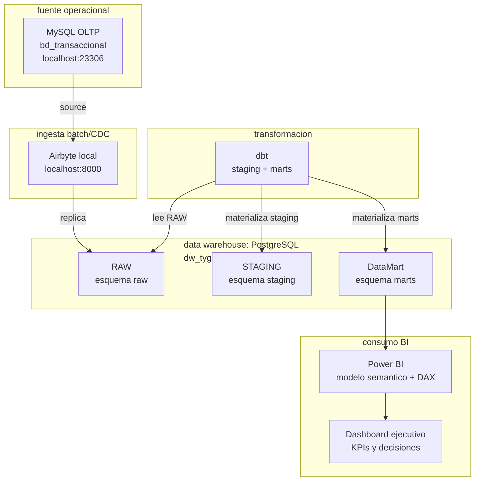

# Inicio: Proyecto Business Intelligence - T&D Angeles E.I.R.L.

Bienvenido a la documentación oficial del proyecto de Inteligencia de Negocios para **T&D Angeles E.I.R.L.**, empresa distribuidora de kits prepago DIRECTV en la macro región sur del Perú. 

Este sitio centraliza todo el desarrollo analítico, desde la extracción de datos de los sistemas transaccionales hasta la visualización en dashboards interactivos.

---

## Producto del curso

Este proyecto es el resultado práctico del curso de **Inteligencia de Negocios** de la Escuela Académico Profesional de Ingeniería de Sistemas en la Universidad Peruana Unión (UPeU).

* **Institución:** Universidad Peruana Unión (UPeU) - FIA
* **Docente:** Ing. Abel Angel Sullon Macalupu
* **Periodo:** Juliaca - 2026
* **Equipo de Desarrollo:**
    * Nick Saim Mayta Jara
    * Henyelrey Lucio Garcia Chura
    * Jhan Logan Ramos Quispe
    * Brayan Raul Condori Quispe

---

## Contenido

El proyecto se desarrolla a lo largo de tres unidades clave que guían la evolución del sistema transaccional hacia un ecosistema analítico maduro y automatizado:

### U1: Definición del sistema de información para ejecutivos
En esta fase se abordó el entendimiento del problema de negocio de T&D Angeles E.I.R.L. Se analizó el modelo comercial de venta y activación de kits DIRECTV, se identificaron las fuentes de datos, los canales de venta (oficinas y puntos de venta externos) y se definieron los **KPIs estratégicos** necesarios para medir el rendimiento comercial y el cumplimiento de metas ante DIRECTV.

### U2: Construcción del BI
Esta fase se centra en la ingeniería de datos. Pasamos de un modelo OLTP (MySQL) a una arquitectura analítica (DataMart en PostgreSQL). Implementamos un pipeline automatizado de ingesta utilizando **Airbyte** y orquestamos las transformaciones y la creación de dimensiones y tablas de hechos (capas Bronze, Silver y Gold) mediante **dbt (data build tool)**.

### U3: Integración y toma de decisiones
Consiste en la explotación de los datos preparados. Se construyó el modelo semántico final y se desarrollaron Dashboards interactivos en **Power BI**, permitiendo a la gerencia monitorear las activaciones, el stock y el rendimiento por oficinas de manera dinámica, facilitando una toma de decisiones informada y ágil.

---

## Observaciones sobre las sesiones

* **Transición tecnológica:** El proyecto evolucionó de procesos de carga manual (scripts SQL convencionales) a un ecosistema moderno de datos (Modern Data Stack) priorizando la automatización.
* **Calidad de datos:** Se observaron retos en la sincronización de fechas entre MySQL y PostgreSQL, los cuales fueron abordados mediante la estandarización de zonas horarias y transformaciones en dbt.
* **Escalabilidad:** Se dejó atrás el procesamiento acoplado al host mediante la división clara entre la ingesta (Airbyte) y la transformación (dbt).

---

## Arquitectura Airbyte

---

## Módulos

## Módulos

La presente documentación en MkDocs se divide en los siguientes componentes y capas del proyecto:

| Módulo | Rol |
| :--- | :--- |
| `oltp-mysql/` | Origen transaccional MySQL con la base `bd_transaccional` |
| `dw-pg/` | PostgreSQL analítico con la base `dw_tyg` |
| `ingesta-debezium/` | Ingesta CDC basada en Debezium para la captura de eventos de cambio |
| `ingesta-airbyte/` | Ingesta batch/configurada con Airbyte como motor de replicación principal |
| `dw-dbt/` | Transformación con dbt desde `raw` hacia `staging` y `marts` |
| `powerbi/` | Modelo semántico, medidas DAX, reportes y dashboards interactivos |
| `docs/` | Libro digital MkDocs con las sesiones, evidencias y guías del proyecto |

---

## Flujo de trabajo

El flujo de vida del dato en este proyecto sigue esta ruta técnica:

1. **OLTP (Origen):** Base de datos transaccional en `MySQL` que registra la venta, distribución y estado de los kits prepago.
2. **Ingesta:** Extracción de datos sin procesar usando conectores de `Airbyte`.
3. **Data Warehouse:** Almacenamiento centralizado en `PostgreSQL`.
4. **Transformación:** Modelado y limpieza de datos ejecutado a través de `dbt` (modelos stagings y marts).
5. **Capa Semántica y BI:** Conexión del DataMart hacia `Power BI` para la creación de métricas (DAX) y visualización.

---

## Enlaces

* 💻 **Repositorio de GitHub:** [Henyelrey/BITyG](https://github.com/Henyelrey/BITyG)